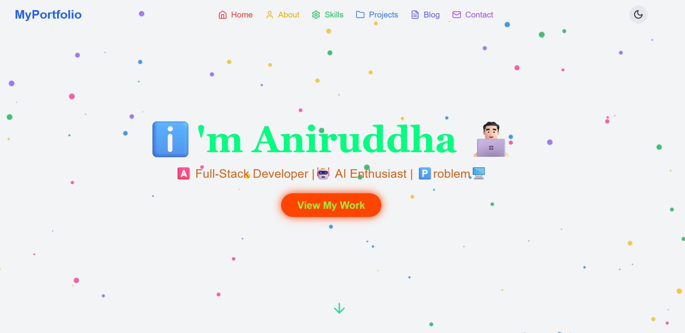

# 👨‍💻 MyPortfolio

Welcome to **MyPortfolio** — a personal website that showcases my skills, projects, blog posts, and more. Built with modern web technologies, this portfolio is designed to be responsive, visually appealing, and easy to navigate.



## 🌟 Features

- **Dark Mode Toggle**: Switch between light and dark themes for an optimized viewing experience.
- **Responsive Design**: Fully responsive on all devices.
- **Interactive Animations**: Smooth transitions and animations for an engaging user experience.
- **Organized Sections**: Separate sections for About, Skills, Projects, Blog, and Contact.

## 🛠️ Tech Stack

- **Frontend**: React, TypeScript
- **Styling**: Tailwind CSS
- **Icons**: Lucide Icons
- **Build Tool**: Vite

## 🚀 Getting Started

Follow these instructions to set up the project locally.

### Prerequisites

- **Node.js** (v14 or higher)
- **npm** or **yarn**

### Installation

1. **Clone the repository:**
   ```bash
   git clone https://github.com/aniruddhaadak80/portfolio.git
   cd portfolio
   ```

2. **Install dependencies:**
   ```bash
   npm install
   # or
   yarn install
   ```

3. **Run the development server:**
   ```bash
   npm run dev
   # or
   yarn dev
   ```

4. **Build for production:**
   ```bash
   npm run build
   # or
   yarn build
   ```

5. **Preview the production build:**
   ```bash
   npm run preview
   # or
   yarn preview
   ```

## 🎨 Customization

To personalize your portfolio, follow these tips:

- **Update Content**: Edit content in the `src/components` directory (e.g., `Header.tsx`, `About.tsx`, `Skills.tsx`).
- **Add New Projects**: Add your projects in the `Projects` section and customize their appearance in `src/components/Projects.tsx`.
- **Theme and Colors**: Modify colors in the `tailwind.config.js` file for a unique theme.

## 📂 Project Structure

```plaintext
MyPortfolio/
├── public/                 # Static assets
├── src/
│   ├── components/         # Components (Header, About, Projects, etc.)
│   ├── assets/             # Images, icons
│   ├── App.tsx             # Main app component
│   └── main.tsx            # Entry point
├── index.html              # HTML template
├── tailwind.config.js      # Tailwind CSS configuration
└── vite.config.ts          # Vite configuration
```

## 🌐 Live Demo

Check out the live version of the portfolio at: [https://aniruddha-adak.vercel.app/](https://aniruddha-adak.vercel.app/)

## 🤝 Contributing

Contributions are welcome! If you have any ideas or improvements, feel free to open a pull request.

1. Fork the repository
2. Create your branch: `git checkout -b my-feature`
3. Commit your changes: `git commit -am 'Add feature'`
4. Push to the branch: `git push origin my-feature`
5. Open a pull request

## 📧 Contact

Feel free to reach out if you have any questions or feedback. Connect with me at:

- **Email**: [aniruddhaadak80@gmail.com](mailto:aniruddhaadak80@gmail.com)
- **LinkedIn**: [LinkedIn Profile](https://linkedin.com/in/aniruddha-adak)
- **Twitter**: [Twitter Handle](https://twitter.com/aniruddha-adak)

---

### 📝 License

This project is licensed under the MIT License. See the [LICENSE](./LICENSE) file for details.
```

### How to Use

1. **Replace `https://yourportfolio.vercel.app`** with the URL of your deployed portfolio.
2. **Add a screenshot** of your portfolio named `screenshot.png` in the root directory for a preview.
3. **Customize contact links** with your own social media or contact links.
4. **Add or edit sections** based on specific features or unique customizations in your portfolio.
